<picture>
  <source media="(prefers-color-scheme: dark)" srcset="./assets/header-dark.svg">
  <source media="(prefers-color-scheme: light)" srcset="./assets/header-light.svg">
  
</picture>

  
  
  
  

---

### `whoami`

I'm an **industrial-engineering student** working at the seam of **industry, data, and business** — the person who understands the factory floor **and** can model it **and** can ship the tool. Currently at **ESITH Casablanca** (Business & Data Management), heading to **ENSAIT, France** for a double degree in textile & industrial engineering.

> **What I do →** I build **AI & data systems for operations and supply chain** — from thermal and forecasting models to full-stack industrial tools that actually run in production.

- 🏭 Interned at **Groupe ONCF**, **OCP Group** & **AdmitEase** · 🏆 **ESITH Hackathon winner** · 4th @ CITx.c
- 🎓 **ESITH → ENSAIT** double degree · 🌍 Arabic · English (B2) · French · +2
- 🧠 Turning **breadth into a spike**: data science × supply-chain optimization for the textile & retail industry

---

### 🚀 Featured Work

<table>
<tr>
<td width="50%" valign="top">

**[⚙️ Smart Maint — GMAO / CMMS](https://github.com/MUAZE12/smartmaint-lcprod)**

Full-stack maintenance platform for a Moroccan edible-oil plant. Real-time sync across **27 Postgres tables**, offline **French/Arabic voice dictation** (in-browser Whisper), a **RAG** knowledge base, and an Arabic **RTL kiosk UI** with a Windows auto-updater. **107 user stories · 16 sprints.**

`Next.js` `React` `TypeScript` `Supabase` `Whisper` `pgvector`

</td>
<td width="50%" valign="top">

**[📦 SIMS — Smart Inventory](https://github.com/MUAZE12/sims-inventory-mustapha-baroudi)**

Inventory-management app for Moroccan SMBs with real-time tracking, interactive **demand forecasting**, and a modern glassmorphism UI.

`JavaScript` `Bootstrap 5` `Chart.js`

 

**[🌐 Portfolio & Certificates](https://github.com/MUAZE12/mustapha-baroudi-portfolio)**

CV (EN/FR), 60+ certificates, and my full professional profile — plus the [live site](https://muaze12.github.io/).

</td>
</tr>
</table>

---

### 🛠️ Stack

**Data & Analytics**
&nbsp;

**Engineering & Dev**
&nbsp;

**Industrial & Business**
&nbsp;

---

### 📊 By the numbers

  
  

---

### 🌱 Currently

Going deep instead of wide — **machine learning**, **operations research / optimization**, and **data engineering**, aimed squarely at supply-chain problems. Preparing for **ENSAIT** and hunting the flagship internship.

  <em>“Bridging the gap between data and business.”</em>
    
  <a href="https://muaze12.github.io/"><b>→ See the full portfolio</b></a>

